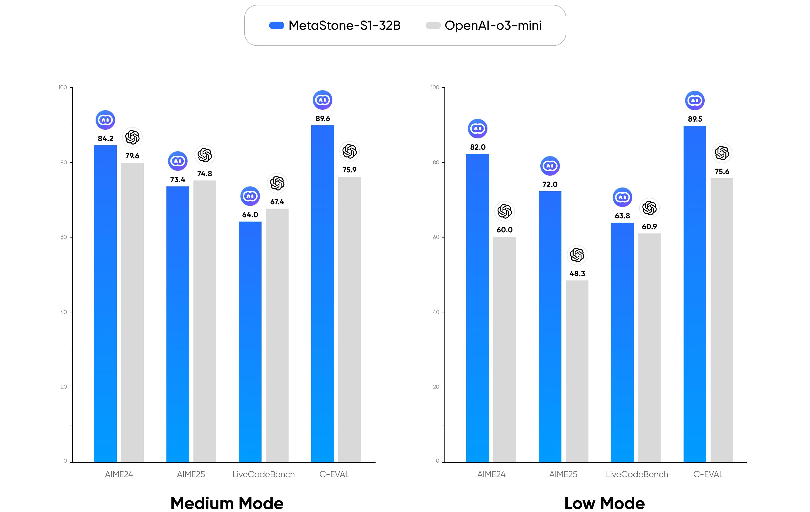
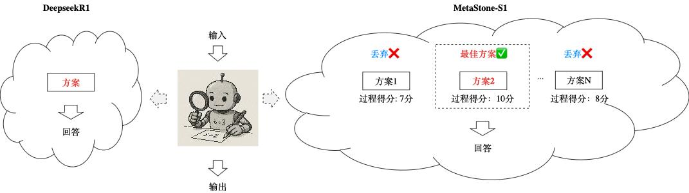

<div align="center">

  [English](./README.md) &nbsp;|&nbsp; [简体中文](./README_zh.md)

</div>

## 简介
我们正式发布首个反思型生成式大模型（Reflective Generative Model）: MetaStone-S1。在数学、代码和中文推理任务上，我们提出的MetaStone-S1仅以32B的参数量达到了与OpenAI-o3系列相近的水平。


MetaStone-S1是基于反思型生成范式训练得到。反思型生成范式是将 **“Long-CoT强化学习”与“过程评分学习”融合的训练范式**，该范式使单个模型同时具备“深度推理”与“高质量推理链路筛选”的能力。通过共享过程评分和策略模型的主干网络，该范式显著降低了99%的过程评分推理耗时，实现了又快又好的文本回答效果。



本仓库包括了MetaStone-S1的模型、训练代码和测试代码。有关模型算法的详细内容请参考[《Test-Time Scaling with Reflective Generative Model》](https://arxiv.org/abs/2507.01951)和[问小白官网](https://www.wenxiaobai.com/)。

## 环境配置
```bash
conda create -n metastone-s1 python==3.10 
conda activate metastone-s1
pip install -e verl
pip install -r requirements.txt
pip install flash_attn==2.7.3
```

## 模型下载

| Model|Transformers(HF) | ModelScope |
|---------------|---------|---------|
|MetaStone-S1-1.5B|[MetaStone-S1-1.5B](https://huggingface.co/MetaStoneTec/MetaStone-S1-1.5B)|[MetaStone-S1-1.5B](https://modelscope.cn/models/MetaStoneTec/MetaStone-S1-1.5B)|
|MetaStone-S1-7B|[MetaStone-S1-7B](https://huggingface.co/MetaStoneTec/MetaStone-S1-7B)|[MetaStone-S1-7B](https://modelscope.cn/models/MetaStoneTec/MetaStone-S1-7B)|
|MetaStone-S1-32B|[MetaStone-S1-32B](https://huggingface.co/MetaStoneTec/MetaStone-S1-32B)|[MetaStone-S1-32B](https://modelscope.cn/models/MetaStoneTec/MetaStone-S1-32B)|


## 模型性能

MetaStone-S1在小尺寸模型上的性能对比

| Model                        | AIME24 | AIME25 | LiveCodeBench | C-EVAL |
|------------------------------|--------|--------|----------------|--------|
| DeepScaleR-1.5B-Preview      | 43.1   | 30.0   | -              | -      |
| R1-Distill-Qwen-1.5B         | 28.9   | 22.8   | 16.9           | 27.1   |
| R1-Distill-Qwen-7B           | 55.5   | -      | 37.6           | -      |
| R1-Distill-Llama-8B          | 50.4   | -      | 39.6           | -      |
| **MetaStone-S1-1.5B-low** | 44.0   | 32.6   | 24.2           | 43.6   |
| **MetaStone-S1-1.5B-medium** | 53.1   | 35.7   | 26.6           | 43.9   |
| **MetaStone-S1-1.5B-high** | 57.9   | 40.4   | 28.1           | 44.1   |
| **MetaStone-S1-7B-low** | 60.7   | 45.4   | 41.7           | 55.1   |
| **MetaStone-S1-7B-medium** | <u>66.3</u>   | <u>48.3</u>   | <u>44.1</u>           | <u>57.5</u>   |
| **MetaStone-S1-7B-high** | **70.2**   | **48.6**   | **44.4**           | **57.8**   |

MetaStone-S1在大尺寸模型上的性能对比。由于本次开源选取的基座模是QwQ32B，因此我们选择了同期的DeepSeek R1-671B-0120版本以实现公平的对比。

| Model                        | AIME24 | AIME25 | LiveCodeBench | C-EVAL |
|------------------------------|--------|--------|----------------|--------|
| s1-32B                       | 56.7   | 50.0   | -              | -      |
| QwQ-32B                      | 79.5   | 69.5   | 63.4           | 88.4   |
| R1-Distill-Qwen-32B          | 72.6   | 49.6   | 57.2           | 82.2   |
| GLM-Z1-32B-0414              | 80.8   | 63.6   | 59.1           | -      |
| DeepSeek-R1-671B             | 79.8   | 70.0   | <u>65.9</u>    | **91.8** |
| Claude-3.5-Sonnet1022        | 16.0   | 7.4    | 37.2           | 76.7   |
| GPT-4o-0513                  | 9.3    | 11.6   | 32.9           | -      |
| OpenAI-o1-mini               | 63.6   | 50.7   | 53.8           | 68.9   |
| OpenAI-o1-1217               | 79.2   | -      | 63.4           | -      |
| OpenAI-o3-mini-medium        | 79.6   | **74.8** | **67.4**   | 75.9   |
| **MetaStone-S1-32B-low** | 82.0   | 72.0   | 63.8           | 89.5   |
| **MetaStone-S1-32B-medium** | <u>84.2</u>   | 73.4   | 64.0           | 89.6   |
| **MetaStone-S1-32B-high** | **85.2**   | <u>73.6</u>   | 64.2           | <u>89.7</u>   |

## 训练

#### 单机训练
```bash
export WANDB_API_KEY=YOUR_WANDB_API_KEY
bash ./scripts/run_single_node.sh
```

#### 多机训练
```bash
# 启动ray
bash ./verl/examples/ray/run_worker_n.sh
# 启动训练
bash ./scripts/run_multi_node.sh
```

#### 保存Huggingface格式的模型参数
```bash
python convert_ckpt.py --root path/to/model --step n --world_size 8
```

## 评估
我们开放了基础版本的测试代码，以及针对数学测试基准的测试流程。

#### 1、部署奖励模型API
```bash
CUDA_VISIBLE_DEVICES=0 python test/score_model_queue.py --model_path path/to/huggingface/model --score_model_dim 1536 --lang 'en' --ip '0.0.0.0' --port '8001'
```

#### 2、部署策略模型API
```bash
export VLLM_ATTENTION_BACKEND=XFORMERS
CUDA_VISIBLE_DEVICES=0 python test/policy_model_queue.py --model_path path/to/huggingface/model --ip '0.0.0.0' --port '8000'
```
推荐同时部署多个API以提高测试效率

#### 3、在目标数据集上进行推理
```bash
python test/inference.py --task 'aime24' --input_file data/aime24.jsonl --output_file path/to/result --n_samples 16 --model_dir path/to/huggingface/model --score_api_url http://ip:port/score --response_api_url "http://ip1:port1/score,http://ip2:port2/score" --branch 2
```
推荐设置branch为2倍的策略模型API数量

#### 4、计算pass@1指标
```bash
python test/compute_metric.py --task 'aime24' --result_paths path/to/result --N 2
```
设置N为2/8/32 对应 low/medium/high 模式

## 引用
如果您觉得我们的工作有所帮助，欢迎引用。
```
@misc{wang2025testtimescalingreflectivegenerative,
 title={Test-Time Scaling with Reflective Generative Model}, 
 author={Zixiao Wang and Yuxin Wang and Xiaorui Wang and Mengting Xing and Jie Gao and Jianjun Xu and Guangcan Liu and Chenhui Jin and Zhuo Wang and Shengzhuo Zhang and Hongtao Xie},
 year={2025},
 eprint={2507.01951},
 archivePrefix={arXiv},
 primaryClass={cs.LG},
 url={https://arxiv.org/abs/2507.01951}, 
}
```